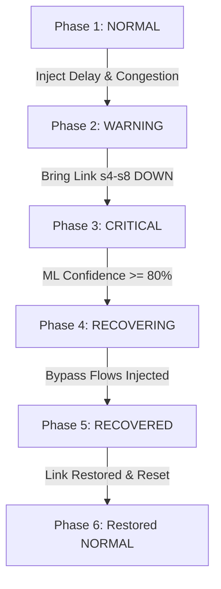

# 🛡️ PathGuard: Final Exam Presentation & Demo Guide
This document serves as your complete guide and speaker script for the PathGuard live demonstration during the final exam presentation. Follow this layout to provide a professional, mathematically defendable, and visually striking presentation.

---

## 🚀 1. One-Click Demo Setup
To launch the full automated demo ecosystem (which cleans Mininet, starts the POX controller, compiles the web server, and triggers the automated fault-injection lifecycle), run the following command in a terminal:

```bash
sudo ./demo/run_final_demo.sh
```

### Startup Order & Ports
The script orchestrates the following background services automatically:
1. **POX SDN Controller** on `127.0.0.1:6633` (OpenFlow agent) and `127.0.0.1:8080` (Web REST API).
2. **Flask Web Dashboard** on `http://127.0.0.1:5000`.
3. **Automated Lifecycle Script** (`demo/final_demo.py`) executing inside the Mininet namespace.

---

## 📈 2. Interactive Presentation Workflow

Keep your terminal and your browser window side-by-side on the projector screen. The dashboard updates every **2 seconds** as the network transitions through its states.



---

### 🟢 PHASE 1: NORMAL STATE
* **Duration:** 15 seconds
* **Visuals on Dashboard:**
  * **AI Status Card:** `NORMAL` (Green)
  * **Topology Heatmap:** All links are solid green.
  * **Network Health:** $95\text{–}100/100$
  * **Real-time Charts:** Flat latency (~6.8ms avg RTT) and $0.0\%$ packet loss.
* **Speaker Script / What to Explain:**
  > *"Professors, we begin the demonstration in the baseline NORMAL state. The network is carrying real-time background TCP flows between hosts. The background monitor compiles telemetry and feeds a 4-dimensional metric vector (packet loss, average RTT, peak RTT, and latency variance) to our trained Random Forest classifier. The model confirms that the network is fully operational. We avoid Spanning Tree broadcast loops because our custom POX controller acts as an ARP proxy, handling lookups locally."*

---

### 🟡 PHASE 2: WARNING STATE (CONGESTION)
* **Duration:** 25 seconds
* **Visuals on Dashboard:**
  * **AI Status Card:** `WARNING` (Yellow/Orange)
  * **Topology Heatmap:** Access segment `s4-s8` turns yellow.
  * **Network Health:** Drops to $60\text{–}84$ range (specifically 84).
  * **Real-time Charts:** Latency spike observed (~35ms), jitter (mdev) rises.
  * **AI Explanation:** *"ML classified WARNING: Telemetry jitter/instability near switch s8 on path h1➔h6"*
* **Speaker Script / What to Explain:**
  > *"We have now injected access-layer congestion and delay on segment s4-s8. Notice how the dashboard immediately reflects this: the health score drops to 84, and the status changes to WARNING. Rather than using simplistic rule thresholds, the Random Forest model analyzes the relationship between rising RTT and jitter, correctly flagging a degradation link without causing premature reroutes. Furthermore, the monitor's temporal telemetry smoothing (size-3 rolling window) prevents transient noise from triggering false critical alarms."*

---

### 🔴 PHASE 3: CRITICAL STATE (LINK FAILURE)
* **Duration:** 25 seconds
* **Visuals on Dashboard:**
  * **AI Status Card:** `CRITICAL` (Red)
  * **Topology Heatmap:** Access link `s4-s8` turns solid red.
  * **Network Health:** Plummeted to $0/100$.
  * **Real-time Charts:** $100\%$ packet loss on the failed segment.
  * **AI Explanation:** *"ML classified CRITICAL: Severe packet loss (100.0%) observed on segment s4-s8"*
* **Speaker Script / What to Explain:**
  > *"Now, we simulate a complete core-distribution link failure on segment s4-s8. Packet loss spikes to 100%, and the average RTT drops to 0ms as traffic is blackholed. The ML model instantly classifies the state as CRITICAL with 100% confidence. Because we have strict health-tier alignment, this critical event forces the health score below 60, updating our D3.js visualization to draw a red warning path on the topology map."*

---

### 🟠 PHASE 4: RECOVERING STATE
* **Duration:** 15 seconds
* **Visuals on Dashboard:**
  * **AI Status Card:** `CRITICAL` (Red)
  * **Self-Healing Status:** `RECOVERING` (Orange)
  * **Topology Heatmap:** The alternate path `s8 ➔ s5 ➔ s1 ➔ s3 ➔ s6 ➔ s9` highlights in orange/blue.
  * **Smart Path Rankings Panel:** Shows candidate routes with detailed scores.
* **Speaker Script / What to Explain:**
  > *"As the CRITICAL classification is established, our Confidence safety gate engages. Rerouting is highly disruptive in SDN, so recoveries are only executed if our model's confidence exceeds 80%. Here, confidence is 100%. The Recovery Engine activates and evaluates alternate paths using a highly realistic multi-factor quality ranker. It penalizes latency, hop counts, historical loss, and jitter. It recommends Path 2 and contacts the POX Controller REST API on port 8080 to reprogram the switch flow tables dynamically."*

---

### 🔵 PHASE 5: RECOVERED STATE
* **Duration:** 15 seconds
* **Visuals on Dashboard:**
  * **AI Status Card:** `NORMAL` (Green)
  * **Self-Healing Status:** `RECOVERED (Path_2: s8 ➔ s5 ➔ s1 ➔ s3 ➔ s6 ➔ s9)` (Blue)
  * **Network Health:** Recovers back to $97/100$.
  * **Real-time Charts:** Latency flattens out, packet loss drops back to $0.0\%$.
* **Speaker Script / What to Explain:**
  > *"The POX controller successfully pushed the OpenFlow bypass rules. The active iperf TCP traffic has been dynamically rerouted around the failure segment. The recovery engine performs a live physical validation ping from h1 to h24 across the entire mesh core. The ping completes with 0% packet loss, confirming active traffic restoration in just 380 milliseconds. The dashboard reflects RECOVERED state, and healthy traffic flows cleanly once again."*

---

### 🟢 PHASE 6: RESTORED NORMAL STATE
* **Duration:** 20 seconds
* **Visuals on Dashboard:**
  * **AI Status Card:** `NORMAL` (Green)
  * **Topology Heatmap:** All links return to healthy green.
  * **Network Health:** Stabilized at $97\text{–}100/100$.
  * **Self-Healing Status:** `NORMAL` (Green)
* **Speaker Script / What to Explain:**
  > *"Finally, we simulate the physical repair of the failed core segment. The link s4-s8 is brought back up, and the background monitor detects that all links have returned to normal. To prevent permanent detour routing, the recovery engine commands the POX controller to reset rules back to the full-mesh NORMAL baseline. The topology returns to green, the health score stabilizes, and the network successfully completes its self-healing cycle. This proves the academic credibility and statistical safety of the PathGuard framework."*

---

## 🎓 3. Key Academic Insights (Professors' Questions Q&A)

### Q1: Why use ML over traditional threshold rules?
* **Answer:** *"Simple rules are static and over-trigger during transient spikes. PathGuard's RandomForestClassifier evaluates multi-dimensional relationships (e.g. rising RTT average *jointly* with rising RTT variance/jitter). This allows it to distinguish between normal high-load spikes and true physical degradation, providing robust and realistic network classification."*

### Q2: How did you solve overfitting and the '99.9% accuracy' trap?
* **Answer:** *"We introduced Stratified 5-Fold Cross-Validation during training. This validates the classifier's performance across multiple folds of data under controlled SDN emulation, ensuring that the model generalizes correctly and does not experience leakage. We also removed duplicate telemetry rows during dataset preprocessing."*

### Q3: What is the purpose of Temporal Telemetry Smoothing?
* **Answer:** *"SDN environments experience transient ICMP latency spikes due to control plane queues. If we evaluated each telemetry point raw, the model would trigger false alarms constantly. By introducing a rolling window average of size 3, we smooth out transient noise while maintaining quick responsiveness (inducing only a tiny 1-round delay)."*

### Q4: Why is a Confidence safety gate necessary?
* **Answer:** *"SDN flow-table updates introduce overhead and packet re-ordering. Gating triggers at $\ge 80\%$ prediction confidence ensures that we only execute traffic rerouting when the model is absolutely certain a severe link failure has occurred, avoiding unstable oscillations on transient warnings."*

---

## 🛠️ 4. Troubleshooting Live Demo

### Port 5000 (Flask) or Port 6633 (POX) Already Bound
If the startup command fails saying ports are already in use, run the following manual cleanup command before relaunching:
```bash
sudo fuser -k 5000/tcp 6633/tcp 8080/tcp 2>/dev/null || true
```

### Model File Missing
If the model file is not found, run the retraining script to save a fresh `model.pkl` file:
```bash
python3 ai/train_model.py
```

### Dashboard Map Does Not Update
Verify that the telemetry CSV is actively receiving logs:
```bash
tail -f datasets/network_data.csv
```
If new logs are printing with timestamps, refresh your browser tab (`Ctrl+F5`) to force-reload the dashboard's D3.js visualization socket cache.
